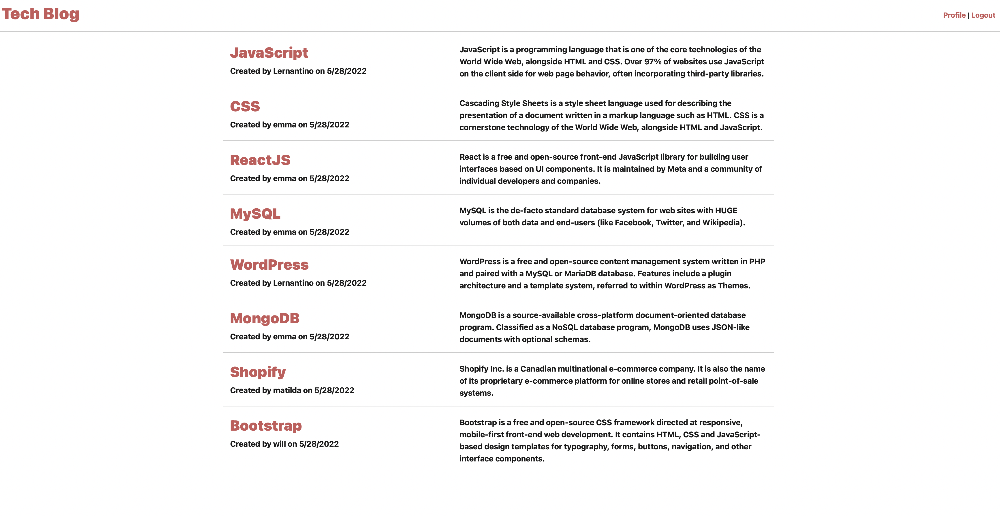
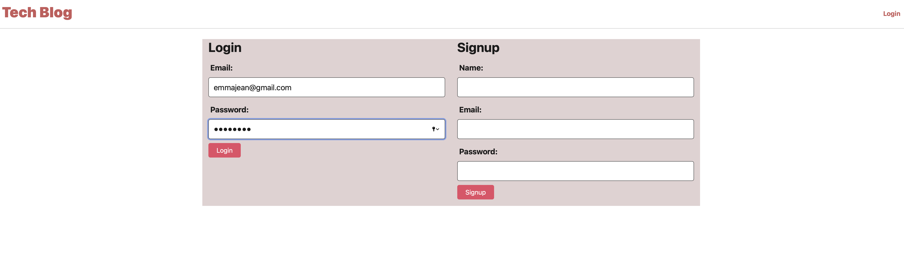
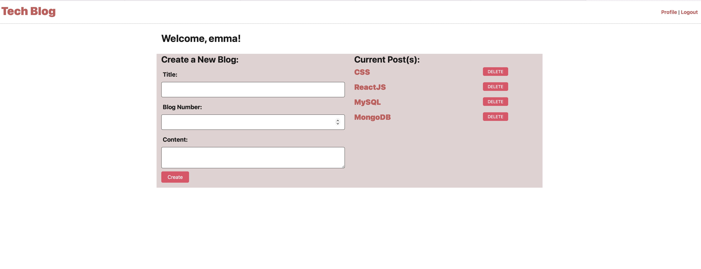

# Tech blog

### Description
This is a full-stack application that would allow users to have authenticated logins to post blogs and comment on other users blogs.

### Install
Users should clone the repo then  install the dependencies necessary to run and use the application, the user should run the following command first:

`npm i`

### Technology used

MySQL, node.js, npm, Express.js, Heroku (Jaws_db), Handlebars.js, dependencies: 'sequelize', 'mysql2', 'bcrypt', 'connect-session-sequelize', 'dotenv', 'express', 'express-handlebars', 'express-session', and VS Code.

### Preview 

### Links
* Deploy Heroku Link: https://my-tech-blog-deploy.herokuapp.com
* GitHub Repo: https://github.com/emma4jesus/Tech-Blog

### License

Read more about the MIT License _[here](https://opensource.org/licenses/MIT)_.

---

### Questions
If you have any questions, please send me an email at: emmanuelajeanbaptiste1@gmail.com 
